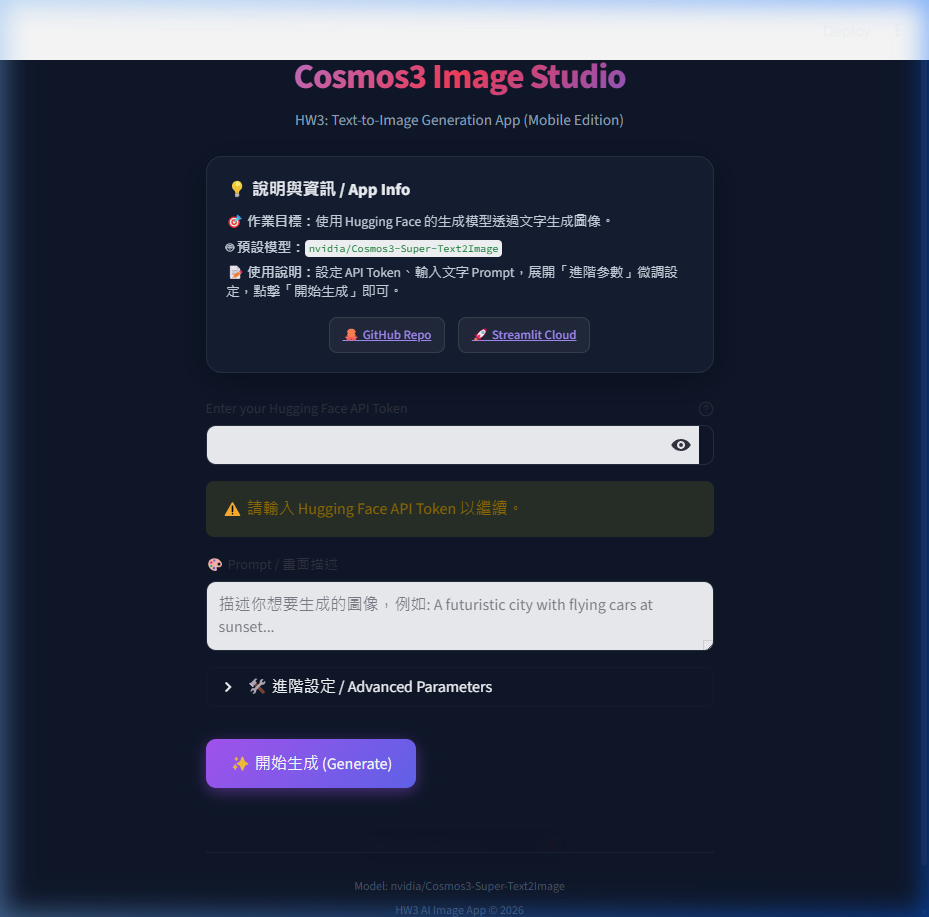

# HW3 Cosmos3-Super-Text2Image App

## Project Goal

This project uses Streamlit and Hugging Face to build a text-to-image generation app with NVIDIA Cosmos3-Super-Text2Image.

## Model

Default Model: `black-forest-labs/FLUX.1-schnell`

Supported Models:
- `black-forest-labs/FLUX.1-schnell` (Default)
- `nvidia/Cosmos3-Super-Text2Image` (HW3 Target Model)
- `stabilityai/stable-diffusion-xl-base-1.0`

## How to Run Locally

### Option 1: Streamlit Version (Recommended)
1. Clone or download the repository.
2. Install the requirements:
   ```bash
   pip install -r requirements.txt
   ```
3. Run the Streamlit application:
   ```bash
   streamlit run app.py
   ```

### Option 2: Static HTML Version
1. Simply double-click the `index.html` file to open it directly in any web browser.
2. It runs completely client-side and interacts with the Hugging Face API directly.
3. Your API token is securely saved locally in your browser's `localStorage` for convenience.

## API Key

Do not hardcode your API key.
You can either:
1. Enter the API key on the web page, or
2. Put it in Streamlit secrets (`.streamlit/secrets.toml`) or environment variables as:
   ```toml
   HF_TOKEN = "your_huggingface_token_here"
   ```

## Deployment

Deploy this project to [Streamlit Community Cloud](https://streamlit.io/cloud). 
Remember to set your `HF_TOKEN` in the Streamlit Cloud advanced settings (Secrets) if you don't want to type it on the webpage every time.

## Links

- GitHub Repo: [GitHub Repo](https://github.com/Frank40281-stack/Cosmos3-Super-Text2Image-App-0604)
- Live Demo (GitHub Pages): [Live Demo](https://frank40281-stack.github.io/Cosmos3-Super-Text2Image-App-0604/)
- Streamlit Demo: [Streamlit Demo Link](https://share.streamlit.io/)

## Screenshots

### Application Homepage


### Generated Result

